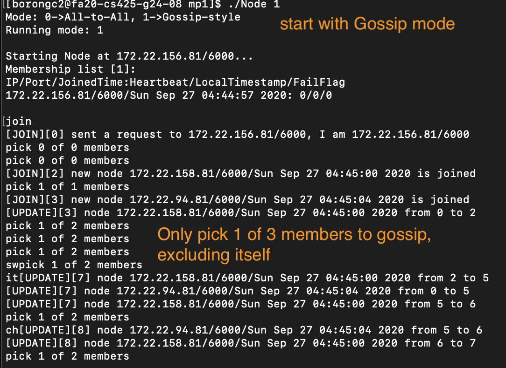
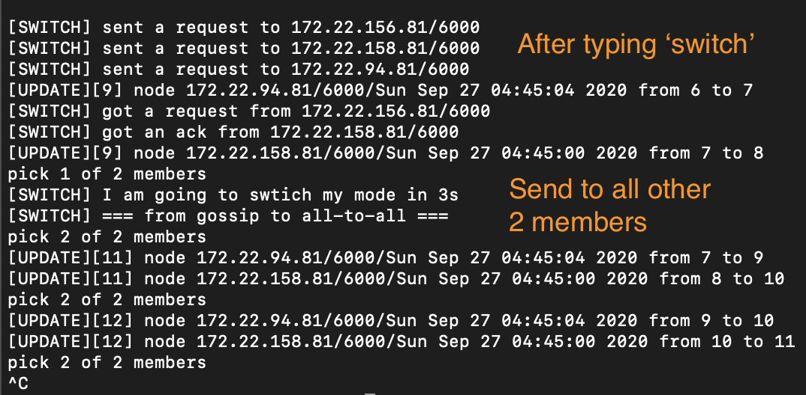

# MP1 Distributed Group Membership

## Executing Instructions
 * Building Node
```
$ make all
```

 * Running All-to-All [default]
```
$ ./Node 0
```

 * Running Gossip-style
```
$ ./Node 1
```

 * Running time commands
```
$ [join] join to a group via fixed introducer
$ [leave] leave the group
$ [id] print id (IP/PORT)
$ [member] print all membership list
$ [switch] switch to other mode (All-to-All to Gossip, and vice versa)
$ [mode] show in 0/1 [All-to-All/Gossip] modes
$ [exit] terminate process
```

 * All logs are in `logs.txt` under the mp1 folder 

## Testing Running Time Commands
 * Switching mode via 3 VMs




## Acknowledgement
 * [Beej's guide](http://beej.us/guide/bgnet/html/multi/index.html)
 * [Multiple Threads](https://www.tutorialspoint.com/cplusplus/cpp_multithreading.htm)
 * [String parser](https://stackoverflow.com/questions/14265581/parse-split-a-string-in-c-using-string-delimiter-standard-c)